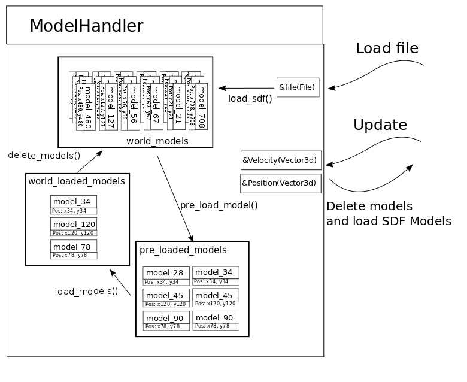

## Project: Dynamic world load
***Gazebo Design Document***

### Overview

This plugin is intended to improve the handling of very big world files that have hundreds or even thousands of models placed in a very large area. The simulation of all those models might be unnecesary because the robot or robots do not interact with all of them, as a consequence lots of computational resources are wasted rendering visuals or resolving physics of objects that are very far away from the robot. As a proposed solution this document attempts to only load part of a world file, based on the position of one or more models. It should be able to load and delete models as robots move in the world, without affecting their behaviour.
It is also the intention of this document to propose an efficient approach to handle these specific worlds, where it is necessary to locate the objects near the robot among all the availables ones.

### Requirements

1. A region (cube or sphere) around one or more models is actively simulated.
2. Only part of the world description is loaded. It must be able to keep track of which models are loaded and which are deleted.
3. It must be able to pre-load the non simulated objects in such a way that the velocity of the model helps determine what models will be required in the near future.
4. It must use the position of these models and its velocity to decide which models can be disabled or removed.
5. It is possible to have other cameras, these cameras can't affect which objects are loaded or deleted.
6. It should be possible to select the area to be loaded.

### Architecture

A new Model Handler class is proposed. Its interactions and main components are described in the picture below. A file pointer or file path is given to the `Load file` interface. It has a `Update` interface to give the position and velocity of one or more robots and returns which models must be deleted (far away from the given position) and the SDF text of the models to be loaded (because are closer to the position).

Internally stores a data structures that describes the models. This structures are generated from the world file and stored in a `world_models`. The model structure contains the name of the model, the position of the model and where the text description of the model is on the world file.

The data type for the `world_models` must be one that allows to organize the models based on its position, so it is efficient to find the models closer to the given position.

The class also is able to pre load models based on the velocity and position of the robot or robots, these models are stored on the list `pre_loaded_models`.

Finally, based on the position given it has a `world_loaded_model` list with the models currently loaded. Every time that the method update is invoked it updates this list, determinating which models must go back to the `world_model`.

### Interfaces

For a final version it should be possible to specify though a inline command to gzclient application if the `.world` load must be dynamic or not. For now it can be compiled as a plugin and use the `-a` command to indicate the world file that needs to be dynamically loaded.

Initial command to be used:
~~~
gzclient -g ./libdynamic_load.so -a file.world
~~~

Definitive intended usage:
~~~
gzclient -d file.world
~~~

### Lifecycle and Ownership

The ModelHandler instances should be available through a public interface and should last the full duration of the program when the dynamic loading is available.

### Performance Considerations

The current work is intended to improve the handling of big worlds. Loading a smaller part of the world should make the load faster, without big delays.

### Tests
List and describe the tests that will be created. For example:

1. Test: Basic functionality
    1. case: Display basic world with few models when the camera is close.
    1. case: Delete models when the camera is far away.
1. Test: Run time efficiency test
    1. case: Must be able to load a small group of models from a huge SDF. It mus be able to load and delete the models efficiently.
1. Improved resource handling
    1. Keep track that the memory, CPU load and gpu perform properly.

### Pull Requests
