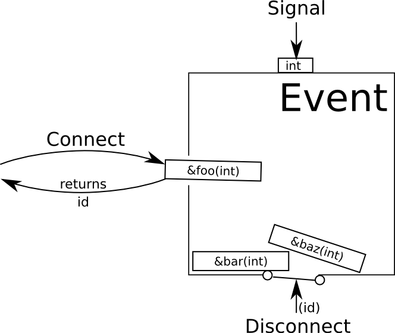

## Project: Event callbacks
***Gazebo Design Document***

### Overview

This is an attempt to document the existing infrastructure in gazebo
for registering callback functions that can be triggered by events.
It also analyzes the object lifecycle and ownership patterns
to determine if the current pointer types are appropriate.

### Requirements

1. A set of classes that allow functions to be registered as callback functions
that will be called when an event is signaled.
These classes should include a mechanism for un-registering callbacks.

2. An set of events relevant to Gazebo's functionality with
callback arguments should be defined.
It should be possible to define other events as well.

3. Callbacks should be able to be registered from different threads.
Signalling the event will block until all the callback functions
have been executed.

4. The callbacks can have arbitrary input parameters
but should all return `void`.

### Architecture

A cartoon diagram of an event is shown below.
The event is drawn as a box with a slot for inserting function pointers
(the `Connect` interface),
a trap door for removing them (the `Disconnect` interface),
and a button at the top that will execute all the callbacks in the box
when it is pushed (the `Signal` interface).
When a callback is added using `Connect`, an `id` is returned.
This `id` is needed to remove the callback using `Disconnect`.

A collection of events relevant to gazebo simulations are defined
as static members of the `gazebo::event::Events` class,
such as the following:

~~~
static EventT<void (bool)> pause;
static EventT<void ()> step;
static EventT<void ()> timeReset;
~~~

The `Events` class also provides functions that wrap
the `Connect` and `Disconnect` methods.

### Interfaces

#### `Event` and `EventT`

There are numerous classes currently involved in the interface
for registering and signaling event callbacks.
There is a base class `Event` and a derived class `EventT`
that is templated on the callback function input paramters.
The `Connect` interface in the diagram returns an `id`,
which is encapsulated in the `Connection`.
The callback can then be removed by passing the Connection object to the
`Event::Disconnect` interface
or by deleting the `Connection` object.
Internally, the event stores each callback as an `EventConnection` instance
in a `std::map` indexed by an `int` id.

~~~
class Connection
{
  public: Connection(Event *_e, int _id);
  public: virtual ~Connection();
  public: int GetId() const;
  private: int id;
  private: Event *event;
};
typedef boost::shared_ptr<Connection> ConnectionPtr;
~~~

~~~
class Event
{
  public: virtual ~Event();
  public: virtual void Disconnect(int _id) = 0;
  public: virtual void Disconnect(ConnectionPtr _c) = 0;
};
~~~

~~~
template<typename T>
class EventConnection
{
  public: EventConnection(const bool _on, boost::function<T> *_cb)
  public: std::atomic_bool on;
  public: std::shared_ptr<boost::function<T> > callback;
};
~~~

~~~
template<typename T>
class EventT : public Event
{
  public: EventT();
  public: virtual ~EventT();
  public: ConnectionPtr Connect(const boost::function<T> &_subscriber);
  public: virtual void Disconnect(int _id);
  public: template<typename P1, ..., typename PN>
          void Signal(const P1 &_p1, ..., const PN &_pN);
  private: std::map<int, std::shared_ptr<EventConnection<T>>> connections;
};
~~~

This is just a summary of the interface classes.
The are some additional classes for implementing the PIMPL idiom
and some components for synchronization and thread safety.

### Lifecycle and Ownership

The `EventT` instances should be available through a public interface
and should be long-lasting.
Currently the instances in `Events.hh` and `GuiEvents.hh`
are implemented as static class variables, so they should last the
full duration of the program.

The `Connection` instances are created during `EventT::Connect`
and returned with ownership transferred to the caller.
When the `Connection` instances are destroyed, the callback is
de-registered.
Classes that store `Connection` instances should destroy these instances
before destroying other private variables that are accessed
by the callback function (see
[gazebo pull request 2250](https://bitbucket.org/osrf/gazebo/pull-requests/2250)
for an example of this type of error).

Since the function pointers are passed as `const` references in
`EventT::Connect`, they must be copied and then stored in the
map of `EventConnection`s.
They will be destroyed when disconnected.

Based on this analysis, the pointer usage could be tightened in a few places:

1. Change `ConnectionPtr` from `boost::shared_ptr` to
`std::unique_ptr<Connection>` since ownership doesn't need to be shared.
Deprecate `Event::Disconnect(ConnectionPtr&)` since
`Event::Disconnect(int)` is used by the destructor,
which should be the preferred cleanup strategy.

2. Store the `boost::function` (or `std::function`) as an object in
`EventConnection` rather than as a smart pointer to the object.

3. Store `EventConnection` objects in the `EventT::connections` map
as unique instead of shared pointers.

### Performance Considerations
Will this project cause changes to performance?
If so, describe how.
One or more performance tests may be required.

### Tests
List and describe the tests that will be created. For example:

1. Thread safety: there is one mutex in `EventT`, but it does not protect all
uses of the private `connections` data.
    1. case:
1. Test 2
    1. case:

### Pull Requests
List and describe the pull requests that will be created to merge this project.
Consider separating large refactoring operations from additions of new code.
For example, the physics::SurfaceParams class was refactored in
[pull request #891](https://bitbucket.org/osrf/gazebo/pull-request/891/refactor)
so that a new FrictionPyramid class could be added in
[pull request #935](https://bitbucket.org/osrf/gazebo/pull-request/935/create).

Keep in mind that smaller, atomic pull requests are easier to review.
