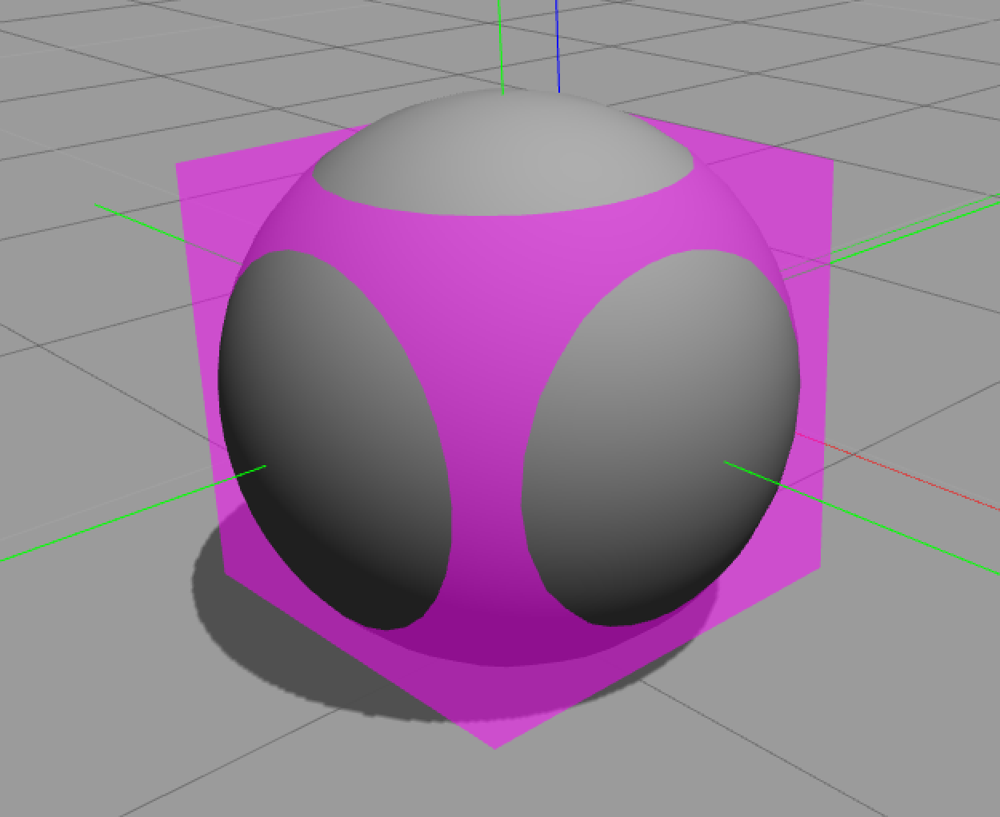
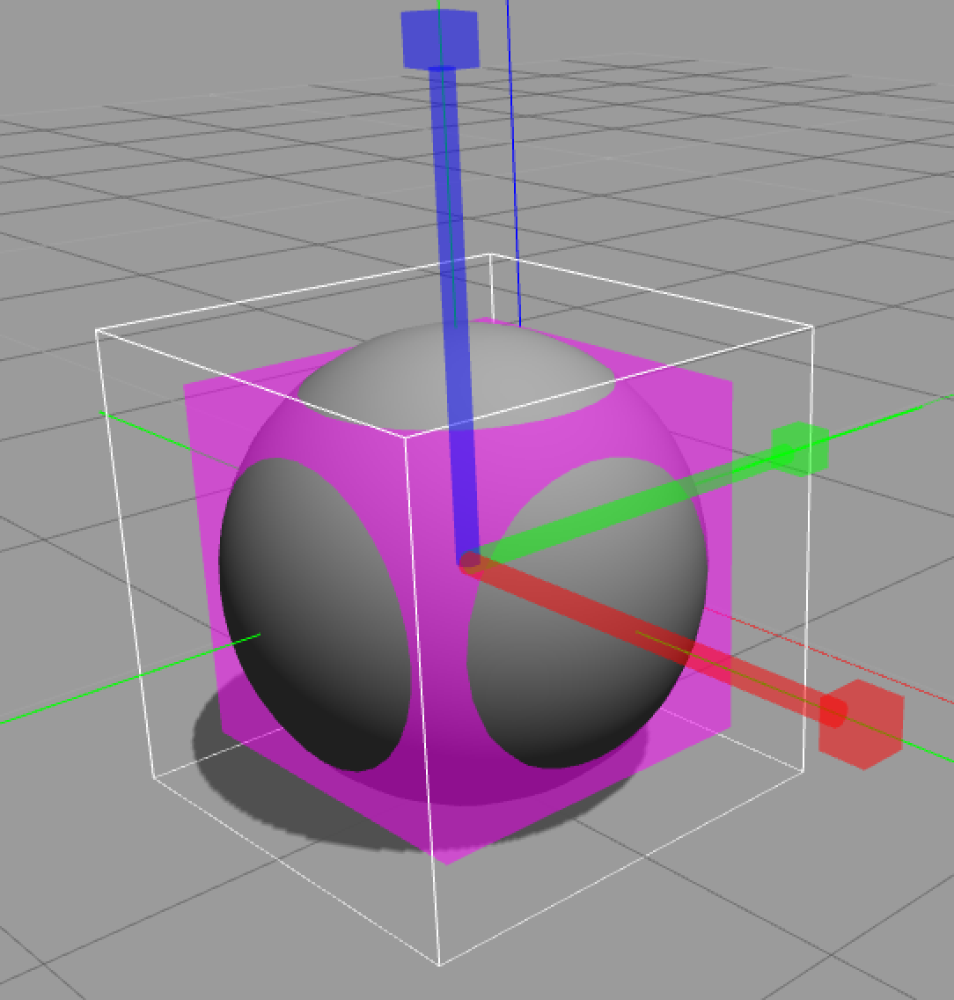

## Project: Graphically Resize Inertia
***Gazebo Design Document***

### Overview

When modeling a robot, one must choose inertial parameter values
for each rigid body (or Link) in the system.
These parameters include the mass, center of mass location,
and the six components of the symmetric 3x3 moment of inertia matrix.
While intuition can often be used to estimate the mass
and location of the center of mass,
it is very difficult to estimate inertia matrix parameters,
which depend on both the mass and size of an object.

For this reason, visualization of the moment of inertia was added to Gazebo in
[pull request 745](https://bitbucket.org/osrf/gazebo/pull-requests/745)
(see also [issue 203](https://bitbucket.org/osrf/gazebo/issues/203)).
While it is useful to visualize the inertia, it would be even more useful
to be able to modify the inertia using interactive markers.
Gazebo currently has the ability to resize simple shapes;
this should be extended to modify the inertia as well.

### Requirements

1. When resizing a simple shape in simulation mode,
scale the inertia values accordingly.
Note that this was implemented for resizing in the Model Editor in
[gazebo pull request 1836](https://bitbucket.org/osrf/gazebo/pull-request/1836).

2. When modifying the mass or density of an object in the Model Editor,
there should be an option for scaling the moment of inertia
according to the new values.
Perhaps the moment of inertia could be "linked" to the
mass / density parameters?

3. Allow the moment of inertia values to be modified in the Model Editor
by attaching interactive markers to the inertia visualization
and scaled in a similar manner to the other resize tool.

4. Properly account for off-diagonal inertia terms.
This requires the ability to diagonalize a 3x3 symmetric
positive definite matrix.
(see [issue 880](https://bitbucket.org/osrf/gazebo/issues/880)).

### Box of equivalent inertia

To visualize inertia, we utilize the concept of a box of equivalent inertia.
Given the mass `m` and principal moments of inertia `Ixx`, `Iyy`, and `Izz`,
the dimensions of a box of uniform density are computed that has
an equivalent moment of inertia.
For example, a box with dimensions `dx`, `dy`, and `dz`
has the following moment of inertia components:

~~~
Ixx = m/12 (dy^2 + dz^2)
Iyy = m/12 (dz^2 + dx^2)
Izz = m/12 (dx^2 + dy^2)
~~~

The equations can be inverted to express the box dimensions
as a function of mass and inertia components:

~~~
dx = sqrt(6/m (Izz + Iyy - Ixx))
dy = sqrt(6/m (Ixx + Izz - Iyy))
dz = sqrt(6/m (Iyy + Ixx - Izz))
~~~

These calculations are currently used to visualize the inertia of an object
as a pink box.

Inertia values for other shapes can be found on
[wikipedia](https://en.wikipedia.org/wiki/List_of_moments_of_inertia).
These could be used to derive alternative visualizations.
The [ellipsoid](https://en.wikipedia.org/wiki/Moment_of_inertia#Inertia_ellipsoid),
for example, is sometimes used for inertia visualization.

### Architecture

Modifying inertia properties graphically will consist of GUI elements
that communicate changes in inertial parameters to the gazebo server
over the `~/model/modify` topic.
This is a proven interface, it simply needs tests to be added for
inertia parameter modification.

### Interfaces

The graphical resizing of inertia can be implemented using
the graphical markers used for the simple shape resize tool,
perhaps with pink arrow heads:

### Performance Considerations
This should not affect simulation performance.

### Tests

1. Change inertial parameters with `~/model/modify` for each physics engine.
    1. Test inertial accessors: in world with no gravity,
       modify mass, inertia components, and center-of-mass location
       and verify that C++ accessors confirm the changes.
    1. Test mass changes: in world with gravity,
       create a balanced seesaw with stacked boxes
       then increase the mass on one side and verify that it tips over.
    1. Test center-of-mass changes: in world with gravity,
       create a balanced seesaw with stacked boxes
       then move the center of mass of the seesaw plank
       towards one of the balanced boxes.
       Verify that it tips over.
    1. Test moment of inertia changes: in world with gravity,
       create swinging pendulum and measure its oscillation frequency.
       Increase the moment of inertia and verify that its oscillation
       frequency decreases.
1. GUI tests in Simulation:
    1. Check that the visuals are updated after a `~/model/modify`
       message is published.
    1. Check that the left panel is updated after a `~/model/modify`
       message is published.
1. Model Editor tests:
    1. Check that values in the link inspector are updated when
       the user resizes the inertia in the 3D view.
    1. Check that inertia visualization (not yet present in the editor)
       updates correctly when the inertia is changed in the link inspector.

### Pull Requests

* Create tests for modifying inertial parameters with `~/model/modify`
  and fix any physics engines that don't support this properly.
* Add methods for diagonalizing a symmetric positive definite matrix to ign-math
  based on discussion in
  [issue 880](https://bitbucket.org/osrf/gazebo/issues/880).
* Correct inertia visualization to account for off-diagonal terms.
* Add GUI tests and features.
