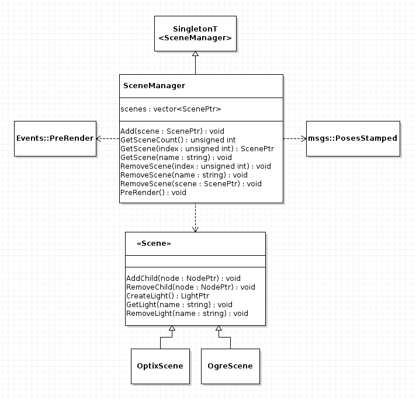
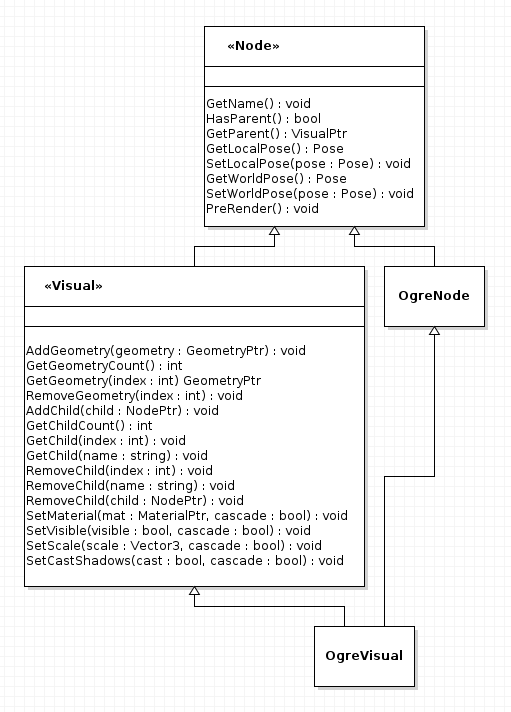
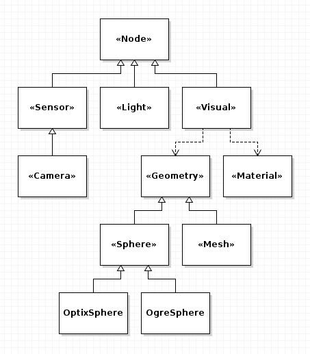

## Abstract Render-Engine Interface for Gazebo
***Gazebo Design Document***

### Overview

We currently make native Ogre calls throughout much of Gazebo. This project
aims to hide rendering implementation details behind an abstract interface, so
that we can easily substitute Ogre with another render-engine in the future.
Admittedly, this will be no easy task, as the very nature of this project
requires much of Gazebo to be modified and even completely rewritten.

### Requirements

The main requirement for this project will be maintaining as much of the
current functionality in the render-engine as possible, as long as it does not
lead to an Ogre-specific API. Additionally, the following functionality should
be provided:

1. Remove all native Ogre calls occurring outside of `gazebo/rendering/ogre`
1. Support runtime render-engine selection
1. Support running multiple render-engines simultaneously

### Architecture

Given then above requirements, we must move away from directly accessing a
`RenderEngine` singleton and allow one to be selected at runtime. For this
reason we propose employing a `RenderEngineManager` singleton to provide access
to the available render-engines. `RenderEngine` instances will be created as
needed, and the references maintained by the `RenderEngineManager`. The UML
diagram below shows this relationship:

Here we see that each new render-engine will need to provide its own
implementation of the pure virtual class `RenderEngine`. As before, the main
purpose of the `RenderEngine` class will be to load needed resources and create
new `Scene` instances.

The `Scene` class will change greatly in this new design. Currently `Scene`
subscribes to topics like `~/visual`, `~/model/info`, and `~/pose/info`.  The
`Scene` class uses these subscriptions to modify itself. We propose moving this
functionality outside of the `Scene` class for three reasons:

1. We may want scenes that are not subject to global modification
1. Each render-engine implementation should not need to reimplement such
functionality
1. It will be easier to keep multiple scenes synchronized

For these reasons, we propose creating a `SceneManager` class that handles the
current functionality of subscribing to these topics and modifying all scenes
that it manages. We can then choose whether or not to register scenes with a
`SceneManager`. Each implementation of `Scene` will then only be responsible
for creating nodes and adding them to its internal scene-graph. The UML diagram
below shows this relationship:

Each element in a scene-graph will be directly or indirectly derived from
an implementation of the abstract `Node` class. The `Node` class provides the
interface for simply setting the pose of an object in the scene-graph. The only
possible internal node in a scene-graph will be the `Visual` class. All other
`Node` subclasses (`Sensor` and `Light`) may only be leaf nodes. Consequently,
the `Visual` class will be the only class to provide functionality to add and
remove children. The UML diagram below shows this relationship:

While this diagram clearly illustrates the dreaded diamond inheritance problem,
we do not believe it will cause any major issues. As the generic `Node` and
`Visual` classes strictly contain pure virtual functions, the `OgreVisual`
class will only inherit functionality from `OgreNode` and implement the
remaining `Visual` interface itself. The full relationship of scene-graph nodes
can be seen in the following UML diagram:

This diagram illustrates an important digression from the current design. The
`Visual` class will now hold reference to the new `Geometry` and `Material`
classes, instead of internalizing that functionality. This enables us to provide
a concise interface for each geometry and to treat composite visuals in a
generic manner (we will not need a `OgreArrowVisual` class, only
`ArrowVisual`). Although it will be possible to add multiple `Geometry`
instances to a single `Visual`, `Geometry` objects themselves do not carry pose
information. So it will be more common to wrap each `Geometry` with its own
`Visual`. This relationship is illustrated in the following UML diagram:

Here we can see how the `ArrowVisual` class references two instances of the
abstract `Visual` class, one for the head of the arrow the other the shaft. It
will create these instances itself via the functions `CreateVisual()`,
`CreateCone()`, and `CreateCylinder()` provided by the `Scene` class. This way
one need only pass an instance of either `OgreScene` or `OptixScene` to
`ArrowVisual` to create an arrow for the desired render-engine.

### Interfaces

As the goal of this project is to remove direct calls to Ogre that occur
outside of the `gazebo/rendering/ogre` namespace, we will creating a very large
API. Additionally, in order to handle multiple render-engines, we will be
modifying some of the existing rendering interfaces.

To start, instead of accessing a `RenderEngine` via a singleton instance, one
must select an engine via the `RenderEngineManager`. This call can be wrapped
by a `RenderingIface` function in a similar fashion as scene creation is
currently being performed:

    RenderEngine* renderEngine = rendering::get_engine("ogre");

Once a developer gains reference to a specific `RenderEngine`, a `Scene` can be
constructed as follows:

    ScenePtr scene = renderEngine->CreateScene("world");

This will create a empty scene that will not be updated automatically via scene
messages sent by the server. Here elements in the scene must be added manually.
However, if you wish to have the scene updated automatically, you will need to
register it with the `SceneManager` as follows:

    SceneManager::Instance()->AddScene(scene);

Whether or not a `Scene` is registered with the `SceneManager`, nodes can be
added manually in the following manner: 

    PointLightPtr light = scene->CreatePointLight("my_light");
    light->setDiffuseColor(0.8, 0.8, 0.8);
    light->setWorldPose(0, 0, 10);
    scene->AddChild(light);

As previously mentioned, `Visual` objects will consist of one or more
`Geometry` instances and a single `Material`, as the following example
illustrates:

    MaterialPtr material = scene->CreateMaterial();
    material->SetAmbient(0.6, 0, 0);
    material->SetDiffuse(0.4, 0, 0);
    material->SetReflectivity(0.25);

    ConePtr cone = scene->CreateCone();
    cone->SetRadius(0.5);
    cone->SetHeight(4);

    VisualPtr visual = scene->CreateVisual("my_visual");
    visual->SetLocalPosition(0, 0, 0);
    visual->SetMaterial(material);
    visual->AddGeometry(cone);

    scene->AddChild(visual);

A `Mesh` geometry can be created in a similar fashion as the `Cone` in this
example. However as `common::Mesh` objects often contain material information,
one can directly create `Visual` for a mesh as follows:

    common::Mesh mesh = common::MeshManager::Instance()->Load(filename);
    VisualPtr visual = scene->CreateVisual("my_mesh", mesh);

This will automatically create a `Geometry` for each submesh as well as its
respective `Material`, bundling everything into a `Visual` instance. Depending
on the `common::Mesh` given, this `Visual` may be composed of one or
instances of `Visual`.

As before, calls to `scene->AddChild()` will only modify the referenced scene.
If you wish to apply changes globally to all scenes managed by the
`SceneManager`, you will need to publish the respective scene update message.

The interface with camera sensors will largely be unchanged, as the
`sensors::CameraSensor` class mainly interfaces directly with
`rendering::Camera` and not Ogre. However the GUI side of Gazebo will undergo
several large internal changes to break its strong ties to Ogre.

### Performance Considerations

There are a few performance concerns inherit in this design:

1. There will be a polymorphic hit in dynamically downcasting references to the
expected implementation type and in calling polymorphic functions. This will
mostly effect node addition and pose updates, but otherwise will not effect
rendering times themselves.
1. There will be additional overhead in managing multiple scenes. Not only will
each implementation create its own internal scene-graph, but the `SceneManager`
will now include an internal for-loop to update each `Scene` it maintains.
1. We will lose the ability to highly tune how Gazebo uses a specific render
engine, which may result in the loss of functionality as well as unoptimized
code.

### Tests

The tests needed for this project will mirror those that current exist in the
`gazebo/rendering` directory. The follow list highlights a few of the most
important:

1. Test: Node Local & World Poses
    1. case: pose as root node 
    1. case: pose as child node
    1. case: pose after parent update
    1. case: pose after transfer
1. Test: Bounding-boxes (Both Root and Leaf Nodes)
    1. case: after geometry shape change
    1. case: after pose update
    1. case: after scale update
    1. case: after child addition
    1. case: after child removal
1. Test: Recursive Properties
    1. case: set visibility with recursive true/false
    1. case: set scale with recursive true/false
    1. case: set cast shadows with recursive true/false
1. Test: Node Creation & Scene Structure
    1. case: create node with duplicate name
    1. case: adding valid node
    1. case: adding null node
    1. case: adding self node
    1. case: adding different render-engine type node
    1. case: removing present node
    1. case: removing absent node
    1. case: destroying absent node
    1. case: destroying present node
    1. case: duplicate name after destruction
    1. case: clearing all nodes
    1. case: transferring nodes
    1. case: compare final generic structure
    1. case: adding valid geometry
    1. case: adding null geometry
    1. case: adding multiple geometries
    1. case: removing present geometry
    1. case: removing absent geometry
    1. case: replacing geometry

### Pull Requests

Given the scope of project, it will be difficult to break all pull requests
into small atomic updates. However, there are a few updates that can be
separated out:

1. Create a dummy `RenderEngineManager` that simply returns the current
`RenderEngine` singleton. Then update all references to the singleton to use
the `RenderEngineManager`.
1. Update current `Visual` to work with internal references to the new
`Geometry` and `Material` objects. External API remains unchanged.
1. Update external API of `Visual` to take `Geometry` and `Material` objects,
updating all external calls.
1. Update remaining rendering API calls to match new design, while keeping the
current underlying implementation. Updating external calls accordingly.
1. Remove all current rendering classes, moving Ogre specific implementation
behind the generic interface classes.
1. Updates SDF handle other materials properties.
1. Update Gazebo to take advantage of new SDF properties.

### Other Comments & Concerns

1. Much of this design has already been implemented with an Optix
render-engine. If you would like to know more design specifics, we would be
happy to share the current API in its entirety. 
1. The current implementation has completely ignored the GUI side of Gazebo,
given its extensive use of Ogre-specfiic calls. We have instead focused
primarily on getting sensors to work. So those working on the GUI side may have
more questions, concerns, and suggestions.
1. Material properties are a work in progress. We have only started expanded
properties needed for ray-tracing and not path-tracing. We aim to provide
sufficient properties for each render-engine, but run the risk of
over-complicating the SDF specifications.
