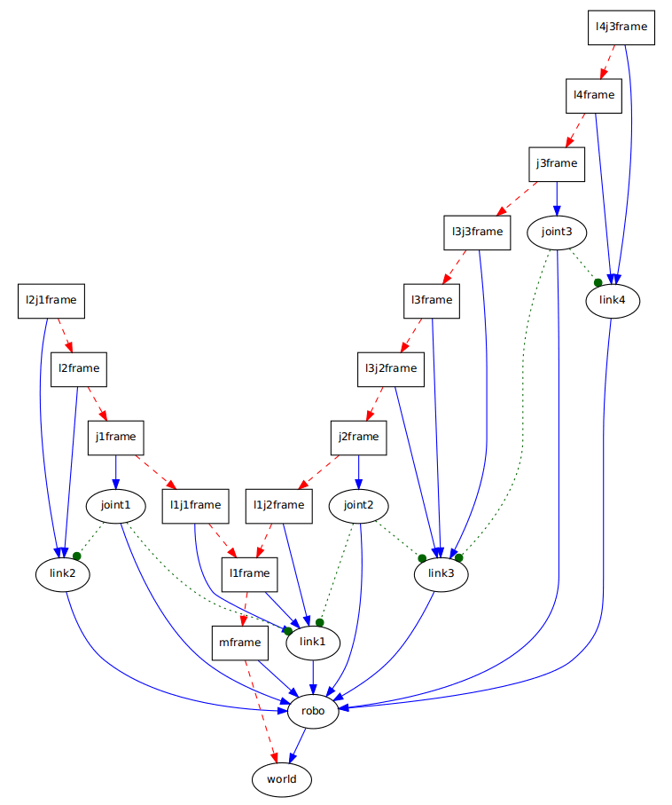

## Project: SDF reference geometry
***SDF Design Document***

### Overview

Inspired by the ROS tf2 library and Solid Work's reference geometry tools, the Idea is to have the ability to define frames of references in SDF and extend the pose element to have a frame origin.

### Requirements

1. Be able to define reference frames in SDF, inside entities like models, links and collissions.
1. Be able to reference that geometry, by using a frame path inside a pose element.
1. Support nested models, by supporting relative (and absolute) paths when referencing paths.
1. Be backwards compatible, by providing default frames for pose elements that do not specify them

### Example

In this example, robot "Robo" is defined in sdf, using frames to define relative poses.

~~~

<sdf version='1.5'>
  <model name="Robo">
~~~

The version of sdf remains 1.5.

We define a frame named mframe (for model frame), relative to the world frame. In a simple world with a single Robo instance, the full path of the frame would be `/world/mframe'. However, this path could be different:

1. If the world contains 2 Robos, the following frame would also exist: `/world/Robo_0/mframe`
1. If Robo was nested inside another model instance called `Mobo`, `/world/Mobo/Robo/mframe` would also point to a valid frame.

The world frame always exists, but all other frames need to be defined.
The model frame "mframe" has an offset of x=1 and y=1 with respect to the world frame.
Like in previous versions of SDF, our model "Robo" has a pose element. The pose element has a new attribute, frame, which makes
this pose relative to the "mframe" frame. Therefore the final pose evaluates to x=2 y=1 in the world frame.

~~~

    <frame name="mframe">
      <pose frame='/world'>1 1 0 0 0 0</pose>
    </frame>
    <pose frame="mframe">1 0 0 0 0 0</pose>

~~~

Link 1 also defines frames:

1. A frame `l1frame` (for link1 frame) is defined relative to mframe. This is the local link frame. The full path for this frame is `/world/Robo/link1/l1frame`. Because the frame `l1frame` is defined using the relative path `../mframe`. This is because the 2 frames are defined under two different entities (model and link).
1. Two joint attachment frames, 'l1j1frame' and `l1j2frame`, both relative to `l1frame`. In a simple world with a single Robo model instance, their full path would be '/world/Robo/link1/l1j1frame' and `/world/Robo/link1/l1j2frame`.

N

~~~

    <link name="link1">
      <frame name="l1frame">
        <pose frame="../mframe">0 0 0 0 0 0</pose>
      </frame>
      <pose frame="l1frame">0 0 0 0 0 0</pose>

      <frame name="l1j2frame">
        <pose frame="l1frame">-1 3 0 0 0 0</pose>
      </frame>

      <frame name="l1j3frame">
        <pose frame="l1frame">2 3 0 0 0 0</pose>
      </frame>
    </link>

~~~

Joint 1 is between Link 1 and Link 2. The local frame for this joint is relative to l1frame.

~~~

    <joint name="joint1">
      <frame name="j1frame">
        <pose frame="../link1/l1j1frame">0 0 0 0 0 0</pose>
      </frame>
      <pose frame="j1frame">0 0 0 0 0 0</pose>
      <parent>link1</parent>
      <child>link3</child>
    </joint>

~~~

Joint 2 is between Link 1 and Link 3. Its frame is also relative to "l1j2frame", the Joint 2 attach frame
on Link 1.

~~~

    <joint name="joint2" type="revolute">
      <frame name="j2frame">
        <pose frame="../link1/l1j2frame">0 0 0 0 0 0</pose>
      </frame>
      <pose frame="j2frame">0 0 0 0 0 0</pose>

      <parent>link1</parent>
      <child>link3</child>

    </joint>

~~~

Link 2 is positioned relative to Joint 1 attach frame on link1

~~~

    <link name="link2">
      <frame name="l2frame">
        <pose frame="../link1/l1j1frame">0 0 0 0 0 0</pose>
      </frame>
      <pose frame="l2frame">0 0 0 0 0 0</pose>
    </link>

~~~

Link 3 is rotated CCW by 90 degrees. It also has a frame for Joint 3 mounting point.

~~~

    <link name="link3">
      <frame name="l3frame">
        <pose frame="../joint2/j2frame">0 0 0 0 0 1.5708</pose>
      </frame>
      <pose frame="l3frame">0 0 0 0 0 0</pose>
      <frame name="l3j2frame">
        <pose frame="l3frame">3 0 0 0 0 0</pose>
      </frame>
    </link>

~~~

Joint 3 is positioned on the attach point.

~~~

    <joint name="joint3" type="revolute">
      <frame name="j3frame">
        <pose frame="../link3/l3j3frame" >0 0 0 0 0 0</pose>
      </frame>
      <pose frame="j3frame">0 0 0 0 0 0</pose>
      <parent>link3</parent>
      <child>link4</child>
    </joint>

~~~

Finally, Link 4. Note the CW rotation.

~~~

    <link name="link4">
      <frame name="l4frame">
        <pose frame="../joint3/j3frame">0 0 0 0 0 -1.5708</pose>
      </frame>
      <pose frame="l4frame">0 0 0 0 0 0</pose>
    </link>

~~~

The following diagram shows the frame hierarchy. In this example, the hierachy has no error:

1. Each frame has a parent frame that can be traced back to the world frame.
1. There are no circular dependencies (no frame has itself has a parent).

To compute the transformation from an origin frame to a destination frame, we use the common ancestor for 2 frames:

 1. Use the origin frame as a starting point
 1. Apply the inverse poses of each parent frame until the common ancestor
 1. Apply the direct pose transformation until the destination frame is reached.
 1. The resulting pose is the Pose of the destination frame relative to the origin frame

Having all these extra frames is more work, but it makes it simple to change link dimensions without having to change multiple poses.

When computing transformation between 2 frames, finding the shortest paths between the two transformations should give more precision in transformations than going all the way to the world frame (because it avoids computing unnecessary transformations that can add error).

### Relative paths

Support for nested models means that frames names should not be absolute. When specifying a pose, the path to the relative frame can thus be relative or absolute.
Here are examples:

1. Absolute path: "/world/model1/nested_model/frame_of_reference"
1. A relative path: "my_link/frame_of_reference"
1. A relative path outside the current scope: "../middle_finger/third_phalange/frame_of_reference"

It is also important to keep in mind that a frame "super_frame" in the path "/world/model/super_frame" could be relative to another frame, even if that frame is not part of the path.

### Challenges

1. The proposed changes makes it more difficult for SDF parsers, because a pose may be defined by a succession of multiple frames. Using the SDF library will shield the user from this added complexity, because it should provide the element lookups to perform this task.
1. Because pose elements are estimated relative to other frame elements, this design introduces the possibility of a circular dependencies, or broken poses.

### Open questions, limitations

1. Should it be possible to define frames in a world file? This could be useful for models defined in the world file, but could prevent a model to be used in any world, unless a default pose is assumed.
1. Is the extra work of defining multiple frames offset by the added benefits? The main benefit is that link geometry can be changed easily, without having to recompute multiple poses.

### Architecture

## ign-math

Proposition: add a new class to ign-math, named "FrameGraph" that contains the tree of frames. Objects of this type will typically be populated with frames as they are read during the parsing of SDF documents.

1. void AddFrame(const string &_name, cconst Pose &_pose, tonst string &_parent);
1. bool ParentFrame(const string &_frame, string &_result, bool canonical=false);
1. bool Pose (const string &_originFrame, const string &_destinationFrame, Pose &_result);

By default, parentFrame returns the path that was initially specified, but the full path can be obtained by passing true for the cannonical parameter.

There is no method to remove a frame, because the typical usage is to add frames while parsing an SDF file, and then use GetPose to evaluate poses that are relative to frames.

## SDFormat changes

The Element class is where the frame information is read from. Each Frame instance has a parent Frame member.

A valid Frame should have a parent list that never visits a single frame more than once (circular dependency), and the end of the list must point to the world frame (otherwise the pose cannot be evaluated numerically). See below for backwards compatibility.

This mechanism will be a modified implmentation of the following function:

~~~
// this is the current version
sdf::Pose sdf::Element::GetValuePose (const std::string &_key = "")

// this is the proposed version. You can specify a relative frame to get the Pose from. By default,
// the absolute position in the world frame is used
sdf::Pose sdf::Element::GetValuePose (const std::string &_key = "", const std::string &_frame="world")

~~~

In order to enumerate the list of frames, the standard sdf::Element and sdf::Param API can be used to identify the correct frame for each Pose Element, and each pose offset from its parent.

A list of all frames encountered during parsing will be maintained, to avoid having to go through all the nodes multiple times. For each frame, the name of the parent frame and the Pose offset should be available directly.

The definition of frames is actually independent of the position of their element in the XML hierarchy. This means that frame elements can be placed in different location in a world or model file, without changing the poses. This is slightly different to the previous behaviour of pose
elements, where the pose is relative to a parent element.

Evaluation of a pose is now done by traversing the list of parents poses backwards, from the world frame to the parent of the final pose.

Appropriate action must be taken when frames are not found, or circular dependencies are detected:

1. Use gzerr to show a console message when the --verbose is set.
1. Provide a default value for the pose.

Using defined frames will be the recommended way forward, but backwards compatibility will be maintained for pose elements that do not have the frame attribute.

The Frame element will also support a "type" or "visual" attribute, to help the gui dislpay axis or coordinate frames.

### Interfaces

1. frame element: This is a new XML SDF element, and its information is available via the sdf::Element API
1. pose element: the frame XML attribute is added to the pose element. The API stays the same.

The sdf::Pose class is not modified. This is because the current Pose is more of a math class (like the ignition math Pose class) than a vehicle to convey frame information. However, it would be possible to extend the sdf::Pose class to expose a list of frames.

### Backwards compatibility

In the current SDF, pose elements do not have a frame attribute. In order to maintain backwards compatibility, the following rules will apply for pose elements when no frame is specified. The following is a list of pose elements, according to their path in the sdf file. It shows how the pose is determined when no frame is provided. The * symbol indicates that multiple nested models can exist in the path.

| Pose element path                           | Implicit frame |
|:-------------------------------------------:|:--------------:|
| <world><include><pose>                      | /world         |
| <world><state><model><pose>                 | /world         |
| <world><include><pose>                      | /world         |
| <world><state><model><pose>                 | /world         |
| <world><light><pose>                        | /world         |
| <sdf/world><actor><pose>                    | /world                                                     |
| <sdf/world><model*><pose>                   | /world for the top most model, or the parent's model pose   |
| <sdf/world><model*><link><pose>             | /world/model*/link (the pose of the link reference frame, relative to the model reference frame. |
| <sdf/world><model*><link><inertial><pose>   | /world/model*/link This is the pose of the inertial reference frame (needs to be at the center of gravity)  |
| <sdf/world><model><link><collision><pose>   | /world/model*/link  |
| <sdf/world><model><link><visual><pose>      | /world/model*/link  |
| <sdf/world><model><joint><pose>             | /world/model*/link  |

### Future improvements

The first step is to implement frames so that they can be specified in sdformat, and loaded by Gazebo.
Support for frames inside Gazebo will come later, and this effort will have its own design. This will include these topics:

1. Where frame information will be displayed for the user
1. 3D feedback for frame origin, and the FrameGraph
1. Upgrades to the Pose message, Join::anchorPose
1. Support in the physics library.
1. Real time updates to the FrameGraph

### Performance Considerations

This design should not impact perfromance much. While there is an added cost to compute each pose element, this cost can be done once when the sdf is loaded.

### Tests

1. Test: FrameGraph in ign math:
    1. case: Return correct Pose when it is relative to the world frame
    1. case: Verify Error when asking for a pose in an unknown frame.
    1. case: Add a frame, and evaluate Poses relative to this frame in the world frame.
    1. case: Add 2 frames and ask for the transform between the 2.
1. Test: reference frames in SDF:
    1. case: define a pose that uses the world frame. A pose with a non existing frame.
    1. case: multiple frame elements, and a pose that uses them. A circular reference.
    1. case: verify that frames work with models defined in a separate sdf file (outside the world file).
    1. case: check that backwards compatibility works when frames are not specified in Pose elements.

### Pull Requests

1. Add the FrameGraph class to the ign math library.
1. Add the Frame and Pose elements to the SDF parser.
1. Add the visual cue to the Frame element so it can be displayed visually by Gazebo

